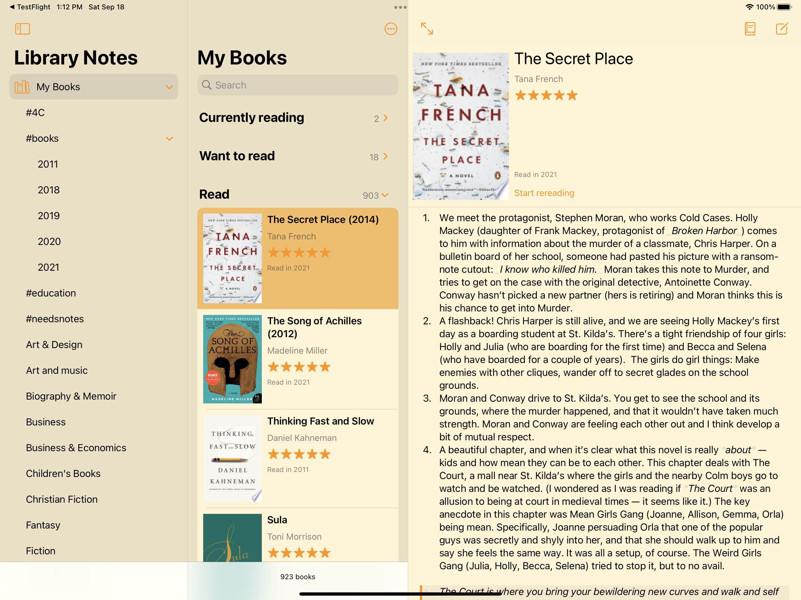
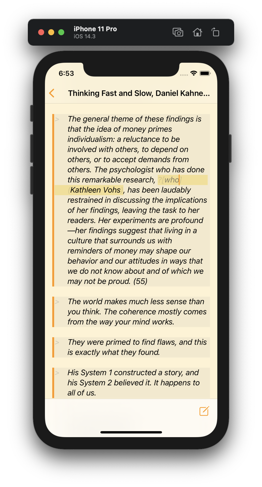
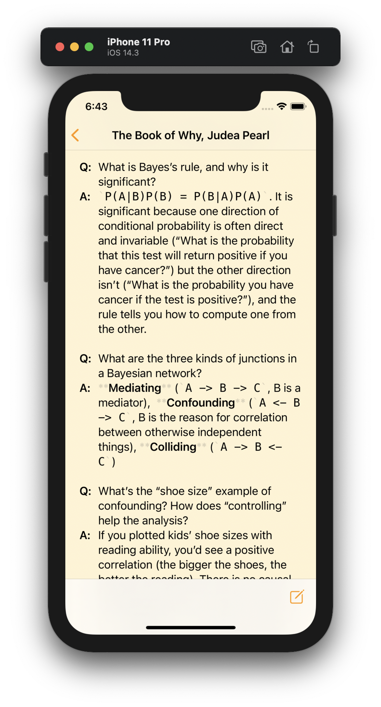

# Grail Diary

Grail Diary is an iOS notes app inspired by [*Commonplace Books*](https://en.wikipedia.org/wiki/Commonplace_book) -- places where to record thoughts and quotes about the things you read. Grail Diary is not for quick, transient, *scrap paper* notes. It's a place to write things that will be meaningful to you for a long time.

> A commonplace book is a central resource or depository for ideas, quotes, anecdotes, observations and information you come across during your life and didactic pursuits. The purpose of the book is to record and organize these gems for later use in your life, in your business, in your writing, speaking or whatever it is that you do. (Ryan Holiday, [*How and Why to Keep a "Commonplace Book"](https://ryanholiday.net/how-and-why-to-keep-a-commonplace-book/)).

What makes Grail Diary different from other notes apps is its *review mode*. Review mode scans your notes for quotes, prompt questions, and [cloze deletions](https://en.wikipedia.org/wiki/Cloze_test). It prompts you with this material to make sure you constantly refresh your memory with all of the great things you've been capturing.

## The Basics

* Grail Diary is a pure client app. There's no service, no accounts, no passwords. You always own your data.
* Runs on the iPad or iPhone and requires iOS 14. (Creating notes works best with an iPad and a keyboard, but reviewing your notes works great on an iPhone.)
* Notes are plain text with Markdown formatting.
* All of your Grail Diary notes are stored in a single file that you can synchronize across your devices with the system of your choice (e.g., iCloud or DropBox). iCloud Document Storage works great for keeping your notes in sync across multiple devices.
* Organize notes with hashtags. You can use hierarchical hashtags, too (e.g., `#books/2021`).
* Fast full-text search.

## Review Mode

As mentioned, Grail Diary's main difference from other applications is *review mode*. A single review mode session consists of up to 20 *prompts* extracted from your notes, and the goal is to refresh your memory about the things you have recorded.

Here's how Grial Diary finds prompts.

1. Quotes

    One of the most common thing to record in a Commonplace Book are quotes that you find meaningful. Grail Diary may prompt you with any of the quotes you have recorded to see if you can remember its source.

2. Cloze deletion

    If identifying the source of a quote isn't a challenging enough prompt, you can make things more challenging with *cloze deletion*. With cloze deletion, you will be prompted with the quote with a word or phrase missing, and your goal will be to see if you can remember that word or phrase later.

    In your markdown notes, you mark words or phrases for cloze deletion using custom syntax inspired by the Markdown syntax for embedding images: `?[hint](phrase to remove)`. For example, in my notes on _Thinking Fast and Slow_, I wanted to remember the name of the researcher who performed this reesearch, I created a cloze deletion inside the quote:

    

    Grail Diary will then prompt me the hint text instead of the researcher's name to see if I can remember *Kathleen Vohs*.

3. Question-and-answer prompts you leave in your notes

    You can write your own questions and answers in your notes that will serve as prompts later. This is particulary helpful when making notes on non-fiction books, where the prompts can help you remember some of the main ideas you have read. 

    A question-and-answer prompt is just two consecutive lines where the first line starts with `Q:` and the second line starts with `A:`.

    

## Implementation Notes

This is a passion project. It exists primarily to scratch an itch (I wanted a place to keep notes about what I read so I can remember more) **and** to be a playground for me to try new things. As a result, there are several things in this implementation that are probably harder than they should be because I wanted to implement things myself as a learning excercise. Specifically:

### Syntax highlighting

Because I wanted to extend Markdown syntax to support new prompt types, Grail Diary does its own Markdown processing. (Actually, there's a lot of formatting that Markdown supports, like embedding arbitrary HTML, that Grail Diary does not support, so internally I call the syntax *Mini Markdown*.) Grail Diary uses a custom *parsing expression grammar* to define the syntax for Mini Markdown (defined in `MiniMarkdownGrammar.swift`), and I implement the incremental packrat parsing algorithm from [Dubroy and Warth](https://ohmlang.github.io/pubs/sle2017/incremental-packrat-parsing.pdf) so I don't have to re-parse everything on each keystroke. Grail Diary implements a custom subclass of `NSTextStorage` to format text in a `UITextView` based on the syntax tree.

While writing this was a fantastic learning experience, this code is super tricky to maintain. At some point it probably makes sense to adopt a more "professional" parsing system.

### Note storage

This project has been through several iterations on how to store notes. I think it's important for any notes app to be as open with its data storage as possible -- your thoughts shouldn't be trapped in a proprietary software stack. Also, Grail Diary is unapolegetically in the Apple software ecosystem. I want to create an excellent iOS (and maybe someday Mac) app. I want it to be as simple as possible for someone else to write an Android or Windows version of Grail Diary that is 100% compatible with the Grail diary notes.

For its first few iterations, Grail Diary stored its notes as plain text files in a directory. This is as open as you can get!

However, Grail Diary currently stores notes in a single sqlite file, using [GRDB](https://github.com/groue/GRDB.swift) for database access. Here's why:

1. **Speed**. It's much faster to get the list of notes, to find all of the prompts contained in the notes, etc.
2. **Full text search**. This is a specific part of "speed" -- Sqlite provides great support for full-text search, and it would be harder to provide this in a text-files-in-a-directory implementation.
3. **With a simple schema, Sqlite is as open as files-in-a-directory.** Sqlite runs *everywhere* and it's rock-solid. As long as the schema is easy to understand, it will be just as easy for Android or Windows software to manipulate Grail Diary notes as it is for the iOS software. (I avoided Core Data because its schema is opaque and tied to the Apple ecosystem.)
4. **Single file containers are awesome.** It's much easier to copy and back up a single file than files in a directory.

The challenge: Native sqlite doesn't play well with iCloud Documents sync, because it knows nothing about Apple's `NSFileCoordinator` and `NSFilePresenter` system. To work around this, Grail Diary currently loads and saves the entire database at once and works with an in-memory database for all intermediate operations. As long as notes remain plain text, this system will scale well. If / when I expand Grail Diary to work with embedded images, though, I'll need some way to do incremental reading and writing.

I designed the database format with personal iCloud documents synchronization in mind. When you support multiple devices working online and offline, conflicts happen. Grail Diary currently supports conflict detection at the note level. As long as the different devices are working on different notes, Grail Diary can seamlessly merge the changes. If two devices edit the same note, Grail Diary uses the *last writer wins* strategy to resolve the conflict. One thing on my to-do list is to maintain each conflicting copy of the note so the user can manually resolve conficts.
